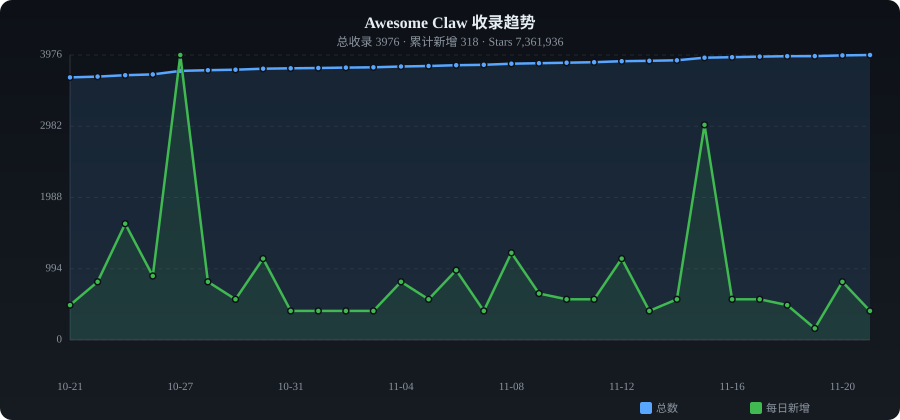

# ✨ Awesome Claw

**English** | [中文](./README_ZH.md)

> Curated collection of OpenClaw, NanoClaw & *claw AI/Agent assistants — auto-collected from GitHub

   

---

## 📈 Trends

---

## 📊 Category Stats

| Category | Count | Share |
|----------|------:|------:|
| 🦞 Claw Variants | 1302 | ██████████ 32.5% |
| 🖥️ Desktop AI Assistant | 462 | ███ 11.5% |
| 🤖 Agent Assistant | 613 | █████ 15.3% |
| 🔧 Tools & Skills | 846 | ███████ 21.1% |
| 📦 Others | 785 | ██████ 19.6% |

---

## 🔥 Daily Trending (2026-11-25)

| # | Project | ⭐ | 📈 Gain | Description |
|:-:|---------|---:|-------:|-------------|
| 1 | [stablyai/orca](https://github.com/stablyai/orca) | 137,293 | +1913 | Orca is the place for working with a fleet of agents (e.g. G |
| 2 | [safishamsi/graphify](https://github.com/safishamsi/graphify) | 76,603 | +923 | AI coding assistant skill (Claude Code, Codex, OpenCode, Ope |
| 3 | [mvanhorn/last30days-skill](https://github.com/mvanhorn/last30days-skill) | 72,384 | +676 | AI agent skill that researches any topic across Reddit, X, Y |
| 4 | [NousResearch/hermes-agent](https://github.com/NousResearch/hermes-agent) | 228,794 | +578 | The agent that grows with you |
| 5 | [calesthio/OpenMontage](https://github.com/calesthio/OpenMontage) | 77,984 | +520 | World's first open-source, agentic video production system.  |
| 6 | [hitkeeen/blender-ai-mcp-addon](https://github.com/hitkeeen/blender-ai-mcp-addon) | 2,387 | +462 | AI assistant and MCP server for Blender: visual chat, scene  |
| 7 | [diegosouzapw/OmniRoute](https://github.com/diegosouzapw/OmniRoute) | 79,187 | +437 | Never stop coding. Free AI gateway: one endpoint, 160+ provi |
| 8 | [Graphify-Labs/graphify](https://github.com/Graphify-Labs/graphify) | 153,179 | +409 | AI coding assistant skill (Claude Code, Codex, OpenCode, Cur |
| 9 | [XingYu-Zhong/DeepSeek-GUI](https://github.com/XingYu-Zhong/DeepSeek-GUI) | 3,568 | +343 | AI agent workspace for DeepSeek models, with Code and Claw m |
| 10 | [paperclipai/paperclip](https://github.com/paperclipai/paperclip) | 116,918 | +342 | The open-source app everyone uses to manage agents at work |
| 11 | [ffroliva/gflow-cli](https://github.com/ffroliva/gflow-cli) | 825 | +295 | MCP server and CLI for Google Flow: generate Veo 3.1 and Omn |
| 12 | [OpenMontageInc/OpenMontage](https://github.com/OpenMontageInc/OpenMontage) | 83,237 | +278 | World's first open-source, agentic video production system.  |
| 13 | [Mintplex-Labs/anything-llm](https://github.com/Mintplex-Labs/anything-llm) | 55,624 | +245 | The all-in-one Desktop & Docker AI application with built-in |
| 14 | [jnMetaCode/agency-agents-zh](https://github.com/jnMetaCode/agency-agents-zh) | 6,068 | +232 | AI 智能体专家团队（中文版）— 161 个专业 AI 智能体人设，支持 Claude Code / Copilot / |
| 15 | [farion1231/cc-switch](https://github.com/farion1231/cc-switch) | 157,074 | +231 | A cross-platform desktop All-in-One assistant tool for Claud |
| 16 | [thedotmack/claude-mem](https://github.com/thedotmack/claude-mem) | 119,674 | +231 | Persistent Context Across Sessions for Every Agent –  Captur |
| 17 | [cheaper-inference/OmniRoute](https://github.com/cheaper-inference/OmniRoute) | 90,234 | +230 | Never stop coding. Free MIT AI gateway: one endpoint, 375 pr |
| 18 | [EverMind-AI/EverOS](https://github.com/EverMind-AI/EverOS) | 8,711 | +212 | A memory OS that makes your OpenClaw agents more personal wh |
| 19 | [nexu-io/open-design](https://github.com/nexu-io/open-design) | 100,889 | +201 | 🎨 Local-first, open-source alternative to Anthropic's Claude |
| 20 | [Alishahryar1/free-claude-code](https://github.com/Alishahryar1/free-claude-code) | 73,125 | +154 | Use claude-code for free in the terminal, VSCode extension o |

---

## 📁 Categories

- [🦞 Claw Variants](#claw-variants) (1302)
- [🖥️ Desktop AI Assistant](#desktop-assistant) (462)
- [🤖 Agent Assistant](#agent-assistant) (613)
- [🔧 Tools & Skills](#tools-skills) (846)
- [📦 Others](#other) (785)

---

### 🦞 Claw Variants

| Project | ⭐ | Language | Description |
|---------|---:|:--------:|-------------|
| [openclaw/openclaw](https://github.com/openclaw/openclaw) | 395,184 | TypeScript | Your own personal AI assistant. Any OS. Any Platform. The lobster way. |
| [NousResearch/hermes-agent](https://github.com/NousResearch/hermes-agent) | 228,794 | Python | The agent that grows with you |
| [ultraworkers/claw-code](https://github.com/ultraworkers/claw-code) | 194,721 | Rust | An agent-managed museum exhibit, built in Rust with Gajae-Code / LazyC |
| [Graphify-Labs/graphify](https://github.com/Graphify-Labs/graphify) | 153,179 | Python | AI coding assistant skill (Claude Code, Codex, OpenCode, Cursor, Gemin |
| [stablyai/orca](https://github.com/stablyai/orca) | 137,293 | TypeScript | Orca is the place for working with a fleet of agents (e.g. Grok Bot, C |
| [thedotmack/claude-mem](https://github.com/thedotmack/claude-mem) | 119,674 | TypeScript | Persistent Context Across Sessions for Every Agent –  Captures everyth |
| [infiniflow/ragflow](https://github.com/infiniflow/ragflow) | 78,972 | Python | RAGFlow is a leading open-source Retrieval-Augmented Generation (RAG)  |
| [safishamsi/graphify](https://github.com/safishamsi/graphify) | 76,603 | Python | AI coding assistant skill (Claude Code, Codex, OpenCode, OpenClaw). Tu |
| [Alishahryar1/free-claude-code](https://github.com/Alishahryar1/free-claude-code) | 73,125 | Python | Use claude-code for free in the terminal, VSCode extension or via disc |
| [mvanhorn/last30days-skill](https://github.com/mvanhorn/last30days-skill) | 72,384 | Python | AI agent skill that researches any topic across Reddit, X, YouTube, HN |
| [VoltAgent/awesome-openclaw-skills](https://github.com/VoltAgent/awesome-openclaw-skills) | 53,978 | - | The awesome collection of OpenClaw skills. 5,400+ skills filtered and  |
| [obsidianmd/obsidian-skills](https://github.com/obsidianmd/obsidian-skills) | 53,720 | Shell | Agent skills for Obsidian. Teach your agent to use Obsidian CLI and op |
| [CherryHQ/cherry-studio](https://github.com/CherryHQ/cherry-studio) | 53,069 | TypeScript | AI productivity studio with smart chat, autonomous agents, and 300+ as |
| [moeru-ai/airi](https://github.com/moeru-ai/airi) | 51,752 | TypeScript | 💖🧸 Self hosted, you-owned Grok Companion, a container of souls of waif |
| [kepano/obsidian-skills](https://github.com/kepano/obsidian-skills) | 51,632 | - | Agent skills for Obsidian. Teach your agent to use Markdown, Bases, JS |
| [HKUDS/nanobot](https://github.com/HKUDS/nanobot) | 50,319 | Python | "🐈 nanobot: The Ultra-Lightweight OpenClaw" |
| [zhayujie/CowAgent](https://github.com/zhayujie/CowAgent) | 48,066 | Python | CowAgent (chatgpt-on-wechat) 是基于大模型的超级AI助理，能主动思考和任务规划、访问操作系统和外部资源、创造和执 |
| [AstrBotDevs/AstrBot](https://github.com/AstrBotDevs/AstrBot) | 47,487 | Python | Agentic IM Chatbot infrastructure that integrates lots of IM platforms |
| [siyuan-note/siyuan](https://github.com/siyuan-note/siyuan) | 44,297 | TypeScript | A privacy-first, self-hosted, fully open source personal knowledge man |
| [zhayujie/chatgpt-on-wechat](https://github.com/zhayujie/chatgpt-on-wechat) | 42,968 | Python | CowAgent是基于大模型的超级AI助理，能主动思考和任务规划、访问操作系统和外部资源、创造和执行Skills、拥有长期记忆并不断成长。同 |
| [alchaincyf/nuwa-skill](https://github.com/alchaincyf/nuwa-skill) | 39,012 | Python | 你想蒸馏的下一个员工，何必是同事。蒸馏任何人的思维方式——心智模型、决策启发式、表达DNA。Distill how anyone think |
| [1Panel-dev/1Panel](https://github.com/1Panel-dev/1Panel) | 37,523 | Go | 🔥 Take full control of your VPS with 1Panel. Deploy OpenClaw in one cl |
| [iOfficeAI/AionUi](https://github.com/iOfficeAI/AionUi) | 34,501 | TypeScript | Free, local, open-source 24/7 Cowork app and OpenClaw for Gemini CLI,  |
| [zeroclaw-labs/zeroclaw](https://github.com/zeroclaw-labs/zeroclaw) | 33,611 | Rust | Fast, small, and fully autonomous AI assistant infrastructure — deploy |
| [garrytan/gbrain](https://github.com/garrytan/gbrain) | 33,577 | TypeScript | Garry's Opinionated OpenClaw/Hermes Agent Brain |
| [iOfficeAI/OfficeCLI](https://github.com/iOfficeAI/OfficeCLI) | 33,573 | C# | OfficeCLI is the world's first and the best Office suite designed for  |
| [hesamsheikh/awesome-openclaw-usecases](https://github.com/hesamsheikh/awesome-openclaw-usecases) | 31,637 | - | A community collection of OpenClaw use cases for making life easier. |
| [nanocoai/nanoclaw](https://github.com/nanocoai/nanoclaw) | 31,160 | TypeScript | A lightweight alternative to OpenClaw that runs in containers for secu |
| [rohitg00/agentmemory](https://github.com/rohitg00/agentmemory) | 30,582 | TypeScript | #1 Persistent memory for AI coding agents based on real-world benchmar |
| [qwibitai/nanoclaw](https://github.com/qwibitai/nanoclaw) | 28,717 | TypeScript | A lightweight alternative to Clawdbot / OpenClaw that runs in containe |
| [titanwings/distilly](https://github.com/titanwings/distilly) | 26,857 | Python | Distilly — Distill how they think into reusable Skills for any Agent o |
| [volcengine/OpenViking](https://github.com/volcengine/OpenViking) | 26,216 | Python | OpenViking is an open-source context database designed specifically fo |
| [titanwings/colleague-skill](https://github.com/titanwings/colleague-skill) | 23,843 | Python | 将冰冷的离别化为温暖的 Skill，欢迎加入数字生命1.0！Transforming cold farewells into warm sk |
| [NVIDIA/NemoClaw](https://github.com/NVIDIA/NemoClaw) | 23,093 | TypeScript | NVIDIA plugin for secure installation of OpenClaw |
| [OthmanAdi/planning-with-files](https://github.com/OthmanAdi/planning-with-files) | 22,937 | Python | Claude Code skill implementing Manus-style persistent markdown plannin |
| [screenpipe/screenpipe](https://github.com/screenpipe/screenpipe) | 22,542 | Rust | YC (S26) | AI that knows what you've seen, said, or heard. Records eve |
| [liyupi/ai-guide](https://github.com/liyupi/ai-guide) | 22,384 | JavaScript | 程序员鱼皮的 AI 资源大全 + Vibe Coding 零基础教程，分享大模型选择指南（DeepSeek / GPT / Gemini / |
| [sipeed/picoclaw](https://github.com/sipeed/picoclaw) | 21,408 | Go | Tiny, Fast, and Deployable anywhere — automate the mundane, unleash yo |
| [teng-lin/notebooklm-py](https://github.com/teng-lin/notebooklm-py) | 20,363 | Python | Unofficial Python API and agentic skill for Google NotebookLM. Full pr |
| [langbot-app/LangBot](https://github.com/langbot-app/LangBot) | 19,204 | Python | Production-grade platform for building agentic IM bots - 生产级多平台智能机器人开发 |

---

### 🖥️ Desktop AI Assistant

| Project | ⭐ | Language | Description |
|---------|---:|:--------:|-------------|
| [cheaper-inference/OmniRoute](https://github.com/cheaper-inference/OmniRoute) | 90,234 | TypeScript | Never stop coding. Free MIT AI gateway: one endpoint, 375 providers (1 |
| [diegosouzapw/OmniRoute](https://github.com/diegosouzapw/OmniRoute) | 79,187 | TypeScript | Never stop coding. Free AI gateway: one endpoint, 160+ providers (50+  |
| [tw93/Pake](https://github.com/tw93/Pake) | 64,022 | Rust | 🤱🏻 Turn any webpage into a desktop app with one command. |
| [DayuanJiang/next-ai-draw-io](https://github.com/DayuanJiang/next-ai-draw-io) | 37,175 | TypeScript | Draw and edit draw.io diagrams by chatting with an AI. Web app, deskto |
| [czlonkowski/n8n-mcp](https://github.com/czlonkowski/n8n-mcp) | 23,240 | TypeScript | A MCP for Claude Desktop / Claude Code / Windsurf / Cursor to build n8 |
| [rowboatlabs/rowboat](https://github.com/rowboatlabs/rowboat) | 17,896 | TypeScript | The multiplayer personal assistant for work |
| [leon-ai/leon](https://github.com/leon-ai/leon) | 17,718 | TypeScript | 🧠 Leon is your open-source personal assistant. |
| [chenhg5/cc-connect](https://github.com/chenhg5/cc-connect) | 16,489 | Go | Bridge local AI coding agents (Claude Code, Cursor, Gemini CLI, Codex) |
| [elie222/inbox-zero](https://github.com/elie222/inbox-zero) | 13,117 | TypeScript | The world's best AI personal assistant for email. Open source app to h |
| [dataelement/bisheng](https://github.com/dataelement/bisheng) | 12,430 | Python | BISHENG is an open-source enterprise Agent platform for building, depl |
| [javaht/claude-desktop-zh-cn](https://github.com/javaht/claude-desktop-zh-cn) | 8,891 | Python | Claude Desktop zh-CN patch for macOS |
| [executeautomation/mcp-playwright](https://github.com/executeautomation/mcp-playwright) | 5,681 | TypeScript | Playwright Model Context Protocol Server - Tool to automate Browsers a |
| [aaddrick/claude-desktop-debian](https://github.com/aaddrick/claude-desktop-debian) | 5,544 | Shell | Claude Desktop for Debian-based Linux distributions |
| [TabularisDB/tabularis](https://github.com/TabularisDB/tabularis) | 5,540 | TypeScript | Open-source desktop SQL workspace for PostgreSQL, MySQL/MariaDB, SQLit |
| [CaviraOSS/LongMemory](https://github.com/CaviraOSS/LongMemory) | 4,587 | TypeScript | Local persistent memory store for LLM applications including claude de |
| [CaviraOSS/OpenMemory](https://github.com/CaviraOSS/OpenMemory) | 4,476 | TypeScript | Local persistent memory store for LLM applications including claude de |
| [campfirein/cipher](https://github.com/campfirein/cipher) | 3,634 | TypeScript | Byterover Cipher is an opensource memory layer specifically designed f |
| [dwgx/WindsurfAPI](https://github.com/dwgx/WindsurfAPI) | 3,161 | JavaScript | Turn Windsurf / Devin Desktop's 100+ AI models (Claude, GPT, Gemini, D |
| [stravu/crystal](https://github.com/stravu/crystal) | 3,128 | TypeScript | (Crystal is now Nimbalyst) Run multiple Codex and Claude Code AI sessi |
| [fossasia/susi_server](https://github.com/fossasia/susi_server) | 2,518 | Java | SUSI.AI server backend - the Artificial Intelligence server for person |
| [jnMetaCode/agency-orchestrator](https://github.com/jnMetaCode/agency-orchestrator) | 2,500 | TypeScript | 🚀 One sentence → multi-AI-role collaboration → complete plan in minute |
| [jhlee0409/omnilogue](https://github.com/jhlee0409/omnilogue) | 2,340 | TypeScript | Desktop app and web server to browse, search and analyze your AI codin |
| [skalesapp/skales](https://github.com/skalesapp/skales) | 2,220 | TypeScript | Free AI Desktop Agent for Windows & macOS - Automate email, calendar,  |
| [iamzhihuix/skills-manage](https://github.com/iamzhihuix/skills-manage) | 2,212 | TypeScript | Desktop app to manage AI coding agent skills across Claude Code, Curso |
| [sdi2200262/agentic-project-management](https://github.com/sdi2200262/agentic-project-management) | 2,137 | JavaScript | A framework for managing complex projects with structured multi-agent  |
| [chongdashu/unreal-mcp](https://github.com/chongdashu/unreal-mcp) | 2,121 | C++ | Enable AI assistant clients like Cursor, Windsurf and Claude Desktop t |
| [cyberagiinc/DevDocs](https://github.com/cyberagiinc/DevDocs) | 2,106 | TypeScript | Completely free, private, UI based Tech Documentation MCP server. Desi |
| [androoAGI/starnet](https://github.com/androoAGI/starnet) | 1,928 | JavaScript | A living pixel-art station where real AI agents do real work. Local-fi |
| [edgerunners-2/capri-ai-desktop](https://github.com/edgerunners-2/capri-ai-desktop) | 1,741 | Python | Cyberpunk AI desktop agent & voice companion for Windows. Supports Cla |
| [ezyang/codemcp](https://github.com/ezyang/codemcp) | 1,602 | Python | Coding assistant MCP for Claude Desktop |
| [maka-agent/maka-agent](https://github.com/maka-agent/maka-agent) | 1,384 | TypeScript | Maka — local-first AI desktop assistant |
| [smithery-ai/mcp-obsidian](https://github.com/smithery-ai/mcp-obsidian) | 1,374 | JavaScript | A connector for Claude Desktop to read and search an Obsidian vault. |
| [haidrrrry/claude-remotion-skill](https://github.com/haidrrrry/claude-remotion-skill) | 1,329 | TypeScript | Open-source Claude agent skill that teaches Claude Code, Claude Deskto |
| [199-biotechnologies/claude-deep-research-skill](https://github.com/199-biotechnologies/claude-deep-research-skill) | 1,230 | Python | Enterprise-grade deep research skill for Claude Code with 8-phase pipe |
| [jamro/tiny-engineer](https://github.com/jamro/tiny-engineer) | 1,224 | C++ | A small desktop robot that brings an AI coding assistant to life, phys |
| [cubezhao/ai-tools-mng](https://github.com/cubezhao/ai-tools-mng) | 1,175 | Vue | 基于 Tauri 的跨平台桌面应用，用于管理多平台 AI 账号 Augment、Antigravity、Windsurf、Cursor、Op |
| [GongRzhe/Gmail-MCP-Server](https://github.com/GongRzhe/Gmail-MCP-Server) | 1,173 | JavaScript | A Model Context Protocol (MCP) server for Gmail integration in Claude  |
| [TonF1917/claude-desktop-multiple-windows-different-api](https://github.com/TonF1917/claude-desktop-multiple-windows-different-api) | 985 | PowerShell | Multiple windows for Claude Desktop with different APIs at the same ti |
| [Anarkh-Lee/universal-db-mcp](https://github.com/Anarkh-Lee/universal-db-mcp) | 945 | TypeScript | 通用数据库 MCP 连接器：支持 MySQL、PostgreSQL、Oracle、MongoDB 等 17 种数据库，支持 Claude D |
| [kruzovic7/ai-data-extractor](https://github.com/kruzovic7/ai-data-extractor) | 844 | Python | Free open-source extractor for AI coding assistant chat histories. Sup |

---

### 🤖 Agent Assistant

| Project | ⭐ | Language | Description |
|---------|---:|:--------:|-------------|
| [ChatGPTNextWeb/NextChat](https://github.com/ChatGPTNextWeb/NextChat) | 88,983 | TypeScript | ✨ Light and Fast AI Assistant. Support: Web | iOS | MacOS | Android |  |
| [khoj-ai/khoj](https://github.com/khoj-ai/khoj) | 38,239 | Python | Your AI second brain. Self-hostable. Get answers from the web or your  |
| [agentscope-ai/QwenPaw](https://github.com/agentscope-ai/QwenPaw) | 38,193 | Python | Your Personal AI Assistant; easy to install, deploy on your own machin |
| [agent0ai/agent-zero](https://github.com/agent0ai/agent-zero) | 19,980 | Python | Agent Zero AI framework |
| [open-metadata/OpenMetadata](https://github.com/open-metadata/OpenMetadata) | 15,869 | TypeScript | The Open Context Layer for Data and AI ,  OpenMetadata is the open pla |
| [yc-software/qm](https://github.com/yc-software/qm) | 15,788 | TypeScript | Multiplayer agent harness for work. https://qm.ycombinator.com |
| [agentscope-ai/CoPaw](https://github.com/agentscope-ai/CoPaw) | 15,022 | Python | Your Personal AI Assistant; easy to install, deploy on your own machin |
| [huggingface/speech-to-speech](https://github.com/huggingface/speech-to-speech) | 13,786 | Python | Speech To Speech: an effort for an open-sourced and modular GPT4-o |
| [TencentCloud/Octop](https://github.com/TencentCloud/Octop) | 12,489 | Python | A smarter, self-hosted AI assistant — multi-user, multi-agent. |
| [tambo-ai/tambo](https://github.com/tambo-ai/tambo) | 11,225 | TypeScript | Generative UI SDK for React |
| [CodeGraphContext/CodeGraphContext](https://github.com/CodeGraphContext/CodeGraphContext) | 4,450 | Python | An MCP server plus a CLI tool that indexes local code into a graph dat |
| [CyberAlbSecOP/Awesome_GPT_Super_Prompting](https://github.com/CyberAlbSecOP/Awesome_GPT_Super_Prompting) | 4,211 | HTML | ChatGPT Jailbreaks, GPT Assistants Prompt Leaks, GPTs Prompt Injection |
| [chartbrew/chartbrew](https://github.com/chartbrew/chartbrew) | 4,097 | JavaScript | Open-source reporting platform to build and share live dashboards from |
| [huangjunsen0406/py-xiaozhi](https://github.com/huangjunsen0406/py-xiaozhi) | 3,563 | Python | Open-source AI assistant ecosystem with MCP integrations, multimodal w |
| [DevAgentForge/Open-Claude-Cowork](https://github.com/DevAgentForge/Open-Claude-Cowork) | 3,395 | TypeScript | OpenSource Claude Cowork. A desktop AI assistant that helps you with p |
| [itsdecodingai/second-brain-ai-assistant-course](https://github.com/itsdecodingai/second-brain-ai-assistant-course) | 3,143 | Jupyter Notebook | Learn to build your Second Brain AI assistant with LLMs, agents, RAG,  |
| [decodingai-magazine/second-brain-ai-assistant-course](https://github.com/decodingai-magazine/second-brain-ai-assistant-course) | 3,138 | Jupyter Notebook | Learn to build your Second Brain AI assistant with LLMs, agents, RAG,  |
| [iamsrikanthnani/pluely](https://github.com/iamsrikanthnani/pluely) | 2,800 | TypeScript | The Open Source Alternative to Cluely - A lightning-fast, privacy-firs |
| [aingdesk/AingDesk](https://github.com/aingdesk/AingDesk) | 2,537 | TypeScript | AingDesk是一款简单好用的AI助手，支持知识库、模型API、分享、联网搜索、智能体，它还在飞快成长中。 AingDesk is a s |
| [Kochava-Studios/witsy](https://github.com/Kochava-Studios/witsy) | 2,045 | TypeScript | Witsy: desktop AI assistant / universal MCP client |
| [ranuts/document](https://github.com/ranuts/document) | 2,036 | TypeScript | Local-first browser editor for Word, Excel, PowerPoint and PDF, with a |
| [openkursar/hello-halo](https://github.com/openkursar/hello-halo) | 1,947 | TypeScript | Open-source Claude Code GUI — like Claude Cowork. Visual AI assistant  |
| [nbonamy/witsy](https://github.com/nbonamy/witsy) | 1,927 | TypeScript | Witsy: desktop AI assistant / universal MCP client |
| [omnimind-ai/OpenOmniBot](https://github.com/omnimind-ai/OpenOmniBot) | 1,892 | Kotlin | 你的端侧 AI 助手，她可以操作终端，也可以完成 Android 世界的广泛任务 || Your on-device AI assistan |
| [t8y2/motty](https://github.com/t8y2/motty) | 1,854 | Go | SSH, SFTP, port forwarding, VNC/RDP and an AI assistant、MCP in one nat |
| [ayaka-notes/ayakaleaf-pro](https://github.com/ayaka-notes/ayakaleaf-pro) | 1,843 | JavaScript | The ultimate open-source Overleaf extension and alternative: a free, s |
| [HKUDS/Auto-Deep-Research](https://github.com/HKUDS/Auto-Deep-Research) | 1,757 | Python | "Your Fully-Automated Personal AI Assistant" |
| [siddsachar/row-bot](https://github.com/siddsachar/row-bot) | 1,696 | Python | Row-Bot - Personal AI Sovereignty. A local-first AI assistant with int |
| [vellum-ai/vellum-assistant](https://github.com/vellum-ai/vellum-assistant) | 1,512 | TypeScript | A personal AI assistant that evolves with you. Memory, personality, pr |
| [jgravelle/AutoGroq](https://github.com/jgravelle/AutoGroq) | 1,509 | Python | AutoGroq is a groundbreaking tool that revolutionizes the way users in |
| [inkeep/agents](https://github.com/inkeep/agents) | 1,501 | TypeScript | Create AI Agents in a No-Code Visual Builder or TypeScript SDK with fu |
| [neovateai/petercat](https://github.com/neovateai/petercat) | 1,493 | TypeScript | A conversational Q&A agent configuration system, self-hosted deploymen |
| [afx-team/petercat](https://github.com/afx-team/petercat) | 1,490 | TypeScript | A conversational Q&A agent configuration system, self-hosted deploymen |
| [SpharxTeam/AgentOS](https://github.com/SpharxTeam/AgentOS) | 1,425 | C | “Non-LangChain Wrapper” New CoreLoopThree architecture and MemoryRovol |
| [agentlas-ai/Agentlas-OS](https://github.com/agentlas-ai/Agentlas-OS) | 1,405 | Python | Desktop AI agent that hires a specialist for each task, works in your  |
| [Lapis0x0/obsidian-yolo](https://github.com/Lapis0x0/obsidian-yolo) | 1,396 | TypeScript | Agent-native AI assistant — chat, write, search, orchestrate, all in o |
| [s2b-dev/smart-second-brain](https://github.com/s2b-dev/smart-second-brain) | 1,358 | TypeScript | A free, open-source Obsidian plugin that makes your vault smarter: bet |
| [JMAN730/opendroid](https://github.com/JMAN730/opendroid) | 1,302 | Kotlin | Your Open Autonomous Android Agent — A production-ready, self-planning |
| [openairymax/agentrt](https://github.com/openairymax/agentrt) | 1,242 | CMake | Airymax AgentRT Transcend context limits. Achieve near-infinite memory |
| [siddsachar/Thoth](https://github.com/siddsachar/Thoth) | 1,223 | Python | Thoth - Personal AI Sovereignty. A local-first AI assistant with 23 in |

---

### 🔧 Tools & Skills

| Project | ⭐ | Language | Description |
|---------|---:|:--------:|-------------|
| [deepseek-ai/deepseek-harness](https://github.com/deepseek-ai/deepseek-harness) | 190,742 | TypeScript | DeepSeek Harness: Everything is a Plugin. |
| [farion1231/cc-switch](https://github.com/farion1231/cc-switch) | 157,074 | TypeScript | A cross-platform desktop All-in-One assistant tool for Claude Code, Co |
| [langgenius/dify](https://github.com/langgenius/dify) | 134,094 | TypeScript | Production-ready platform for agentic workflow development. |
| [paperclipai/paperclip](https://github.com/paperclipai/paperclip) | 116,918 | TypeScript | The open-source app everyone uses to manage agents at work |
| [nexu-io/open-design](https://github.com/nexu-io/open-design) | 100,889 | TypeScript | 🎨 Local-first, open-source alternative to Anthropic's Claude Design. ⚡ |
| [OpenMontageInc/OpenMontage](https://github.com/OpenMontageInc/OpenMontage) | 83,237 | Python | World's first open-source, agentic video production system. 12 product |
| [anthropics/skills](https://github.com/anthropics/skills) | 80,521 | Python | Public repository for Agent Skills |
| [calesthio/OpenMontage](https://github.com/calesthio/OpenMontage) | 77,984 | Python | World's first open-source, agentic video production system. 11 pipelin |
| [OpenHands/OpenHands](https://github.com/OpenHands/OpenHands) | 69,601 | Python | 🙌 OpenHands: AI-Driven Development |
| [Mintplex-Labs/anything-llm](https://github.com/Mintplex-Labs/anything-llm) | 55,624 | JavaScript | The all-in-one Desktop & Docker AI application with built-in RAG, AI a |
| [PostHog/posthog](https://github.com/PostHog/posthog) | 41,109 | Python | :hedgehog: PostHog is the leading platform for building self-driving p |
| [tinyhumansai/openhuman](https://github.com/tinyhumansai/openhuman) | 39,652 | Rust | OpenHuman is an open source personal AI for Mac, Windows and Linux — l |
| [bytedance/UI-TARS-desktop](https://github.com/bytedance/UI-TARS-desktop) | 39,589 | TypeScript | The Open-Source Multimodal AI Agent Stack: Connecting Cutting-Edge AI  |
| [mksglu/context-mode](https://github.com/mksglu/context-mode) | 34,470 | JavaScript | Privacy-first. MCP is the protocol for tool access. We're the virtuali |
| [Zackriya-Solutions/meetily](https://github.com/Zackriya-Solutions/meetily) | 32,380 | Rust | Privacy first, AI meeting assistant with 4x faster Parakeet/Whisper li |
| [alirezarezvani/claude-skills](https://github.com/alirezarezvani/claude-skills) | 30,461 | Python | 169 production-ready skills & plugins for Claude Code, OpenAI Codex, a |
| [vercel-labs/agent-desktop](https://github.com/vercel-labs/agent-desktop) | 26,590 | Rust | Computer use CLI for AI agents |
| [activepieces/activepieces](https://github.com/activepieces/activepieces) | 21,377 | TypeScript | AI Agents & MCPs & AI Workflow Automation • (~400 MCP servers for AI a |
| [wanshuiyin/Auto-claude-code-research-in-sleep](https://github.com/wanshuiyin/Auto-claude-code-research-in-sleep) | 19,863 | Python | ARIS ⚔️ (Auto-Research-In-Sleep) — Lightweight Markdown-only skills fo |
| [eigent-ai/eigent](https://github.com/eigent-ai/eigent) | 15,888 | TypeScript | Eigent: The Open Source Cowork Desktop to Unlock Your Exceptional Prod |
| [NanmiCoder/cc-haha](https://github.com/NanmiCoder/cc-haha) | 15,553 | TypeScript | Local-first cross-platform desktop workspace for Claude Code / agents: |
| [OrchestratorInc/agent-orchestrator](https://github.com/OrchestratorInc/agent-orchestrator) | 15,118 | Go | Run and supervise teams of coding agents from planning to merge. Any h |
| [tonhowtf/omniget](https://github.com/tonhowtf/omniget) | 14,509 | Rust | Udemy & Hotmart course downloader, YouTube downloader (yt-dlp GUI, 1,8 |
| [triggerdotdev/trigger.dev](https://github.com/triggerdotdev/trigger.dev) | 14,156 | TypeScript | Trigger.dev – build and deploy fully‑managed AI agents and workflows |
| [Untrivial-ai/agent-orchestrator](https://github.com/Untrivial-ai/agent-orchestrator) | 12,719 | Go | Run and supervise teams of coding agents from planning to merge. Any h |
| [bytebot-ai/bytebot](https://github.com/bytebot-ai/bytebot) | 11,072 | TypeScript | Bytebot is a self-hosted AI desktop agent that automates computer task |
| [sigoden/aichat](https://github.com/sigoden/aichat) | 10,599 | Rust | All-in-one LLM CLI tool featuring Shell Assistant, Chat-REPL, RAG, AI  |
| [tanweai/pua](https://github.com/tanweai/pua) | 10,475 | TypeScript | 你是一个曾经被寄予厚望的 P8 级工程师。Anthropic 当初给你定级的时候，对你的期望是很高的。  一个agent使用的高能动性的sk |
| [mcp-use/mcp-use](https://github.com/mcp-use/mcp-use) | 10,465 | TypeScript | The fullstack MCP framework to develop MCP Apps for ChatGPT / Claude & |
| [wonderwhy-er/DesktopCommanderMCP](https://github.com/wonderwhy-er/DesktopCommanderMCP) | 10,414 | TypeScript | This is MCP server for Claude that gives it terminal control, file sys |
| [CoplayDev/unity-mcp](https://github.com/CoplayDev/unity-mcp) | 9,909 | C# | Unity MCP acts as a bridge, allowing AI assistants (like Claude, Curso |
| [Agents365-ai/drawio-skill](https://github.com/Agents365-ai/drawio-skill) | 8,957 | - | Claude Code skill for generating Draw.io diagrams (.drawio XML) and ex |
| [firerpa/lamda](https://github.com/firerpa/lamda) | 8,768 | Python | Android Full-Stack Device Control Platform: WebRTC/H.264 remote deskto |
| [vastsa/PI-Desktop](https://github.com/vastsa/PI-Desktop) | 8,215 | TypeScript | Local-first AI coding agent desktop: Electron + Rust host core + pi Ag |
| [xingkongliang/skills-manager](https://github.com/xingkongliang/skills-manager) | 7,770 | TypeScript | A lightweight desktop app to manage, sync, and organize AI agent skill |
| [YaoApp/yao](https://github.com/YaoApp/yao) | 7,682 | Go | ✨ All your agents and workspaces in one place, on every device you own |
| [mnfst/manifest](https://github.com/mnfst/manifest) | 7,511 | TypeScript | Smart LLM routing for OpenClaw. Cut Costs up to 70% |
| [tradesdontlie/tradingview-mcp](https://github.com/tradesdontlie/tradingview-mcp) | 7,305 | JavaScript | AI-assisted TradingView chart analysis — connect Claude Code to your T |
| [11cafe/jaaz](https://github.com/11cafe/jaaz) | 6,764 | TypeScript | The world's first open-source multimodal creative assistant  This is a |
| [ThinkInAIXYZ/deepchat](https://github.com/ThinkInAIXYZ/deepchat) | 6,409 | TypeScript | 🐬DeepChat - A smart assistant that connects powerful AI to your person |

---

### 📦 Others

| Project | ⭐ | Language | Description |
|---------|---:|:--------:|-------------|
| [openai/codex](https://github.com/openai/codex) | 116,683 | Rust | Lightweight coding agent that runs in your terminal |
| [OpenInterpreter/open-interpreter](https://github.com/openinterpreter/openinterpreter) | 63,856 | Python | A lightweight coding agent for open models like Deepseek, Kimi, and Qw |
| [msitarzewski/agency-agents](https://github.com/msitarzewski/agency-agents) | 60,230 | Shell | A complete AI agency at your fingertips - From frontend wizards to Red |
| [mem0ai/mem0](https://github.com/mem0ai/mem0) | 50,786 | Python | Universal memory layer for AI Agents |
| [666ghj/MiroFish](https://github.com/666ghj/MiroFish) | 40,409 | Python | A Simple and Universal Swarm Intelligence Engine, Predicting Anything. |
| [CopilotKit/CopilotKit](https://github.com/CopilotKit/CopilotKit) | 38,968 | TypeScript | The Frontend for Agents & Generative UI. React + Angular |
| [getzep/graphiti](https://github.com/getzep/graphiti) | 24,118 | Python | Build Real-Time Knowledge Graphs for AI Agents |
| [slopus/happy](https://github.com/slopus/happy) | 24,081 | TypeScript | Happy is the open-source desktop app for Claude Code, Codex, and Grok, |
| [HKUDS/CLI-Anything](https://github.com/HKUDS/CLI-Anything) | 21,672 | Python | CLI-Anything: Making ALL Software Agent-Native |
| [eosphoros-ai/DB-GPT](https://github.com/eosphoros-ai/DB-GPT) | 20,327 | Python | open-source agentic AI data assistant for the next generation of AI +  |
| [dzhng/deep-research](https://github.com/dzhng/deep-research) | 19,928 | TypeScript | An AI-powered research assistant that performs iterative, deep researc |
| [trycua/cua](https://github.com/trycua/cua) | 19,905 | Python | Open-source infrastructure for Computer-Use Agents. Sandboxes, SDKs, a |
| [badlogic/pi-mono](https://github.com/badlogic/pi-mono) | 18,614 | TypeScript | AI agent toolkit: coding agent CLI, unified LLM API, TUI & web UI libr |
| [arc53/DocsGPT](https://github.com/arc53/DocsGPT) | 18,378 | Python | Private AI platform for agents, assistants and enterprise search. Buil |
| [HKUDS/DeepCode](https://github.com/HKUDS/DeepCode) | 14,983 | Python | "DeepCode: Open Agentic Coding (Paper2Code & Text2Web & Text2Backend)" |
| [fathah/hermes-desktop](https://github.com/fathah/hermes-desktop) | 14,628 | TypeScript | Desktop Companion for Hermes Agent |
| [NoFxAiOS/nofx](https://github.com/NoFxAiOS/nofx) | 12,461 | Go | Your personal AI trading assistant. Any market. Any model. Pay with US |
| [EKKOLearnAI/ekko-studio](https://github.com/EKKOLearnAI/ekko-studio) | 11,815 | TypeScript | Ekko Studio is a local-first AI workspace for multi-agent chat, coding |
| [EKKOLearnAI/hermes-studio](https://github.com/EKKOLearnAI/hermes-studio) | 11,157 | TypeScript | Ekko Studio is a local-first AI workspace for multi-agent chat, coding |
| [nightly-labs/openbot](https://github.com/nightly-labs/openbot) | 10,669 | TypeScript | A local-first desktop workspace for persistent AI teammates. Run Codex |
| [openchamber/openchamber](https://github.com/openchamber/openchamber) | 9,291 | TypeScript | Desktop and web interface for OpenCode AI agent |
| [op7418/CodePilot](https://github.com/op7418/CodePilot) | 6,523 | TypeScript | A desktop GUI for Claude Code — chat, code, and manage projects visual |
| [generalaction/emdash](https://github.com/generalaction/emdash) | 6,306 | TypeScript | Emdash Classic is the open-source desktop app for running coding agent |
| [apache/maka](https://github.com/apache/maka) | 6,005 | TypeScript | Apache Maka (Incubating) is a local-first AI agent workspace. Model me |
| [Mai-with-u/MaiBot](https://github.com/Mai-with-u/MaiBot) | 5,439 | Python | MaiSaka, an LLM-based intelligent agent, is a digital lifeform devoted |
| [SaladDay/cc-switch-cli](https://github.com/SaladDay/cc-switch-cli) | 5,180 | Rust | ⭐️ A cross-platform CLI All-in-One assistant tool for Claude Code, Cod |
| [langwatch/langwatch](https://github.com/langwatch/langwatch) | 5,055 | TypeScript | Open-Source Agent Observability & Evals for AI Platform teams. Trace,  |
| [PurpleDoubleD/locally-uncensored](https://github.com/PurpleDoubleD/locally-uncensored) | 4,688 | TypeScript | Local AI desktop app — chat, agent mode, image gen, video gen. Support |
| [spacering-net/codeg](https://github.com/spacering-net/codeg) | 4,645 | Rust | Collaborative multi-agent AI coding workspace: aggregate sessions from |
| [zhukunpenglinyutong/desktop-cc-gui](https://github.com/zhukunpenglinyutong/desktop-cc-gui) | 4,614 | TypeScript | Multi-engine AI coding desktop client (Tauri). Claude Code, Codex, Gem |
| [sooryathejas/METATRON](https://github.com/sooryathejas/METATRON) | 4,323 | Python | AI-powered penetration testing assistant using local LLM on linux (Par |
| [yuruotong1/autoMate](https://github.com/yuruotong1/autoMate) | 4,008 | Python | Like Manus, Computer Use Agent(CUA) and Omniparser, we are computer-us |
| [claraverse-space/ClaraVerse](https://github.com/claraverse-space/ClaraVerse) | 3,896 | Go | Claraverse is a opesource privacy focused ecosystem to replace ChatGPT |
| [router-for-me/EasyCLIProxyAPI](https://github.com/router-for-me/EasyCLIProxyAPI) | 3,776 | Rust | A desktop GUI for CLIProxyAPI and a tool for automatically configuring |
| [ExplosiveCoderflome/AI-Novel-Writing-Assistant](https://github.com/ExplosiveCoderflome/AI-Novel-Writing-Assistant) | 3,558 | TypeScript | 面向长篇小说创作的 AI Native 开源系统，用 Agent、世界观、写法引擎、RAG 和整本生产工作流，帮助新手从一句灵感走到完整小说 |
| [BytePioneer-AI/codex-host](https://github.com/BytePioneer-AI/codex-host) | 3,435 | TypeScript | Run Pi and Claude Code directly in Codex Desktop. 在 Codex Desktop 中直接运 |
| [felinics/Memoh](https://github.com/felinics/Memoh) | 2,827 | Go | ✨ The open-source multi-agent platform. Every agent gets its own compu |
| [anthropics/claude-desktop-buddy](https://github.com/anthropics/claude-desktop-buddy) | 2,725 | C++ | Reference and an example for the Bluetooth API for makers in Claude Co |
| [Leonxlnx/agentic-ai-prompt-research](https://github.com/Leonxlnx/agentic-ai-prompt-research) | 2,573 | - | Research into how agentic AI coding assistants work — reconstructed pr |
| [e2b-dev/open-computer-use](https://github.com/e2b-dev/open-computer-use) | 2,416 | Python | AI computer use powered by open source LLMs and E2B Desktop Sandbox |

---

## 🤝 Contributing

Pull requests welcome!

---

## 📜 License

---

✨ Auto-curated · 2026-11-25 21:08:04

