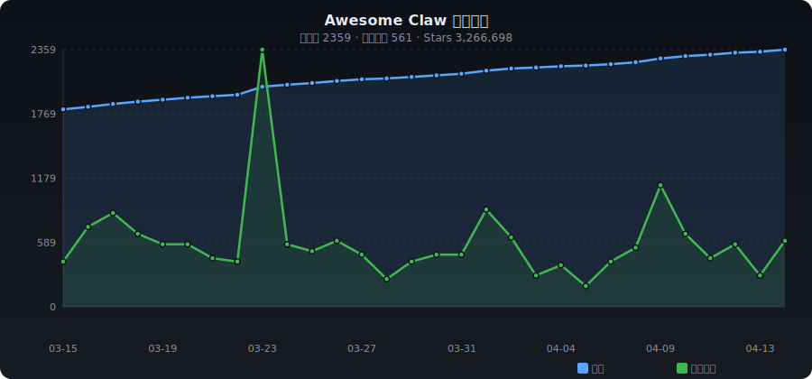

# ✨ Awesome Claw

[English](./README.md) | **中文**

> OpenClaw、NanoClaw 等 claw 系 AI 助理与 Agent 助理精选 —— 自动收录整理

   

---

## 📈 收录趋势

<p align="center"></p>

---

## 📊 分类统计

| 分类 | 数量 | 占比 |
|------|-----:|-----:|
| 🦞 Claw 系客户端 | 983 | █████████████ 39.3% |
| 🖥️ 桌面 AI 助理 | 293 | ███ 11.7% |
| 🤖 Agent 助理 | 373 | ████ 14.9% |
| 🔧 工具与 Skills | 364 | ████ 14.6% |
| 📦 其他 | 487 | ██████ 19.5% |

---

## 🔥 每日热门 (2026-04-30)

| # | 项目 | ⭐ | 📈 日增 | 描述 |
|:-:|------|---:|-------:|------|
| 1 | [NousResearch/hermes-agent](https://github.com/NousResearch/hermes-agent) | 126,094 | +1903 | 随着你成长的代理人 |
| 2 | [farion1231/cc-switch](https://github.com/farion1231/cc-switch) | 56,289 | +1013 | A cross-platform desktop All-in-One assistant tool... |
| 3 | [safishamsi/graphify](https://github.com/safishamsi/graphify) | 38,716 | +935 | AI coding assistant skill (Claude Code, Codex, Ope... |
| 4 | [Alishahryar1/free-claude-code](https://github.com/Alishahryar1/free-claude-code) | 18,875 | +742 | Use claude-code for free in the terminal, VSCode e... |
| 5 | [openclaw/openclaw](https://github.com/openclaw/openclaw) | 366,641 | +458 | Your own personal AI assistant. Any OS. Any Platfo... |
| 6 | [mksglu/context-mode](https://github.com/mksglu/context-mode) | 11,394 | +348 | Privacy-first. MCP is the protocol for tool access... |
| 7 | [kepano/obsidian-skills](https://github.com/kepano/obsidian-skills) | 27,653 | +314 | Agent skills for Obsidian. Teach your agent to use... |
| 8 | [jau123/MeiGen-AI-Design-MCP](https://github.com/jau123/MeiGen-AI-Design-MCP) | 836 | +295 | MeiGen-AI-Design-MCP — Turn Claude Code / OpenClaw... |
| 9 | [Mintplex-Labs/anything-llm](https://github.com/Mintplex-Labs/anything-llm) | 55,624 | +245 | The all-in-one Desktop & Docker AI application wit... |
| 10 | [jnMetaCode/agency-agents-zh](https://github.com/jnMetaCode/agency-agents-zh) | 6,068 | +232 | AI 智能体专家团队（中文版）— 161 个专业 AI 智能体人设，支持 Claude Code /... |
| 11 | [garrytan/gbrain](https://github.com/garrytan/gbrain) | 12,427 | +226 | Garry's Opinionated OpenClaw/Hermes Agent Brain |
| 12 | [iOfficeAI/AionUi](https://github.com/iOfficeAI/AionUi) | 23,098 | +215 | Free, local, open-source 24/7 Cowork app and OpenC... |
| 13 | [hesamsheikh/awesome-openclaw-usecases](https://github.com/hesamsheikh/awesome-openclaw-usecases) | 30,570 | +157 | A community collection of OpenClaw use cases for m... |
| 14 | [alirezarezvani/claude-skills](https://github.com/alirezarezvani/claude-skills) | 13,266 | +133 | 169 制作准备的技能和插件:Claude Code,OpenAI Codex和OpenClaw 工... |
| 15 | [chenhg5/cc-connect](https://github.com/chenhg5/cc-connect) | 6,849 | +129 | Bridge local AI coding agents (Claude Code, Cursor... |
| 16 | [win4r/memory-lancedb-pro](https://github.com/win4r/memory-lancedb-pro) | 1,785 | +124 | 增强了OpenClaw的LanceDB内存插件 混合检索 (矢量+BM25),跨编码器排名,多范围隔... |
| 17 | [iOfficeAI/OfficeCLI](https://github.com/iOfficeAI/OfficeCLI) | 2,605 | +109 | OfficeCLI is the world's first and the best Office... |
| 18 | [higress-group/hiclaw](https://github.com/higress-group/hiclaw) | 1,116 | +97 | 开源代理团队系统,基于IM的多代理合作和人力监督. |
| 19 | [espressif/esp-claw](https://github.com/espressif/esp-claw) | 811 | +96 | ESP-Claw, a Chat Coding AI agent framework for IoT... |
| 20 | [HKUDS/nanobot](https://github.com/HKUDS/nanobot) | 41,367 | +93 | "🐈 nanobot: The Ultra-Lightweight OpenClaw" |

---

## 📁 分类目录

- [🦞 Claw 系客户端](#claw-variants) (983)
- [🖥️ 桌面 AI 助理](#desktop-assistant) (293)
- [🤖 Agent 助理](#agent-assistant) (373)
- [🔧 工具与 Skills](#tools-skills) (364)
- [📦 其他](#other) (487)

---

### <a id="claw-variants"></a>🦞 Claw 系客户端

| 项目 | ⭐ | 语言 | 描述 |
|------|---:|:----:|------|
| [openclaw/openclaw](https://github.com/openclaw/openclaw) | 366,641 | TypeScript | Your own personal AI assistant. Any OS. Any Platform. The lobster way.... |
| [NousResearch/hermes-agent](https://github.com/NousResearch/hermes-agent) | 126,094 | Python | The agent that grows with you |
| [infiniflow/ragflow](https://github.com/infiniflow/ragflow) | 78,972 | Python | RAGFlow is a leading open-source Retrieval-Augmented Generation (RAG) ... |
| [VoltAgent/awesome-openclaw-skills](https://github.com/VoltAgent/awesome-openclaw-skills) | 47,612 | - | The awesome collection of OpenClaw skills. 5,400+ skills filtered and ... |
| [CherryHQ/cherry-studio](https://github.com/CherryHQ/cherry-studio) | 44,810 | TypeScript | AI productivity studio with smart chat, autonomous agents, and 300+ as... |
| [zhayujie/CowAgent](https://github.com/zhayujie/CowAgent) | 43,903 | Python | CowAgent (chatgpt-on-wechat) 是基于大模型的超级AI助理，能主动思考和任务规划、访问操作系统和外部资源、创造和执... |
| [siyuan-note/siyuan](https://github.com/siyuan-note/siyuan) | 43,083 | TypeScript | A privacy-first, self-hosted, fully open source personal knowledge man... |
| [zhayujie/chatgpt-on-wechat](https://github.com/zhayujie/chatgpt-on-wechat) | 42,968 | Python | CowAgent是基于大模型的超级AI助理，能主动思考和任务规划、访问操作系统和外部资源、创造和执行Skills、拥有长期记忆并不断成长。同... |
| [HKUDS/nanobot](https://github.com/HKUDS/nanobot) | 41,367 | Python | "🐈 nanobot: The Ultra-Lightweight OpenClaw" |
| [moeru-ai/airi](https://github.com/moeru-ai/airi) | 38,801 | TypeScript | 💖🧸 Self hosted, you-owned Grok Companion, a container of souls of waif... |
| [safishamsi/graphify](https://github.com/safishamsi/graphify) | 38,716 | Python | AI coding assistant skill (Claude Code, Codex, OpenCode, OpenClaw). Tu... |
| [1Panel-dev/1Panel](https://github.com/1Panel-dev/1Panel) | 35,227 | Go | 🔥 Take full control of your VPS with 1Panel. Deploy OpenClaw in one cl... |
| [AstrBotDevs/AstrBot](https://github.com/AstrBotDevs/AstrBot) | 31,044 | Python | Agentic IM Chatbot infrastructure that integrates lots of IM platforms... |
| [zeroclaw-labs/zeroclaw](https://github.com/zeroclaw-labs/zeroclaw) | 30,835 | Rust | Fast, small, and fully autonomous AI assistant infrastructure — deploy... |
| [hesamsheikh/awesome-openclaw-usecases](https://github.com/hesamsheikh/awesome-openclaw-usecases) | 30,570 | - | A community collection of OpenClaw use cases for making life easier. |
| [qwibitai/nanoclaw](https://github.com/qwibitai/nanoclaw) | 28,410 | TypeScript | A lightweight alternative to Clawdbot / OpenClaw that runs in containe... |
| [kepano/obsidian-skills](https://github.com/kepano/obsidian-skills) | 27,653 | - | Agent skills for Obsidian. Teach your agent to use Markdown, Bases, JS... |
| [mvanhorn/last30days-skill](https://github.com/mvanhorn/last30days-skill) | 24,365 | Python | AI agent skill that researches any topic across Reddit, X, YouTube, HN... |
| [volcengine/OpenViking](https://github.com/volcengine/OpenViking) | 23,284 | Python | OpenViking is an open-source context database designed specifically fo... |
| [iOfficeAI/AionUi](https://github.com/iOfficeAI/AionUi) | 23,098 | TypeScript | Free, local, open-source 24/7 Cowork app and OpenClaw for Gemini CLI, ... |
| [sipeed/picoclaw](https://github.com/sipeed/picoclaw) | 21,408 | Go | Tiny, Fast, and Deployable anywhere — automate the mundane, unleash yo... |
| [NVIDIA/NemoClaw](https://github.com/NVIDIA/NemoClaw) | 19,977 | TypeScript | NVIDIA plugin for secure installation of OpenClaw |
| [OthmanAdi/planning-with-files](https://github.com/OthmanAdi/planning-with-files) | 19,974 | Python | Claude Code skill implementing Manus-style persistent markdown plannin... |
| [Alishahryar1/free-claude-code](https://github.com/Alishahryar1/free-claude-code) | 18,875 | Python | Use claude-code for free in the terminal, VSCode extension or via disc... |
| [gavrielc/nanoclaw](https://github.com/qwibitai/nanoclaw) | 17,137 | TypeScript | A lightweight alternative to Clawdbot / OpenClaw that runs in containe... |
| [RightNow-AI/openfang](https://github.com/RightNow-AI/openfang) | 17,075 | Rust | Open-source Agent Operating System |
| [openimsdk/open-im-server](https://github.com/openimsdk/open-im-server) | 16,284 | Go | IM Chat ChatGPT OpenClaw |
| [langbot-app/LangBot](https://github.com/langbot-app/LangBot) | 15,938 | Python | Production-grade platform for building agentic IM bots - 生产级多平台智能机器人开发... |
| [cft0808/edict](https://github.com/cft0808/edict) | 15,523 | Python | 🏛️ 三省六部制 · OpenClaw Multi-Agent Orchestration System — 9 specialized A... |
| [casdoor/casdoor](https://github.com/casdoor/casdoor) | 13,522 | Go | An open-source AI-first Identity and Access Management (IAM) /AI MCP &... |
| [NevaMind-AI/memU](https://github.com/NevaMind-AI/memU) | 13,494 | Python | Memory for 24/7 proactive agents like openclaw (moltbot, clawdbot). |
| [liyupi/ai-guide](https://github.com/liyupi/ai-guide) | 12,809 | JavaScript | 程序员鱼皮的 AI 资源大全 + Vibe Coding 零基础教程，分享大模型选择指南（DeepSeek / GPT / Gemini /... |
| [garrytan/gbrain](https://github.com/garrytan/gbrain) | 12,427 | TypeScript | Garry's Opinionated OpenClaw/Hermes Agent Brain |
| [teng-lin/notebooklm-py](https://github.com/teng-lin/notebooklm-py) | 12,185 | Python | Unofficial Python API and agentic skill for Google NotebookLM. Full pr... |
| [nearai/ironclaw](https://github.com/nearai/ironclaw) | 12,073 | Rust | IronClaw is OpenClaw inspired implementation in Rust focused on privac... |
| [aiming-lab/AutoResearchClaw](https://github.com/aiming-lab/AutoResearchClaw) | 11,826 | Python | Fully autonomous research from idea to paper. Chat an Idea. Get a Pape... |
| [getumbrel/umbrel](https://github.com/getumbrel/umbrel) | 11,147 | TypeScript | An elegant home server OS. Run OpenClaw, store your files and photos, ... |
| [cloudflare/moltworker](https://github.com/cloudflare/moltworker) | 9,875 | TypeScript | Run OpenClaw, (formerly Moltbot, formerly Clawdbot) on Cloudflare Work... |
| [activeloopai/deeplake](https://github.com/activeloopai/deeplake) | 9,107 | C++ | Deeplake is a unified context engine for AI agents such as OpenClaw. B... |
| [MemTensor/MemOS](https://github.com/MemTensor/MemOS) | 8,828 | Python | AI memory OS for LLM and Agent systems(moltbot,clawdbot,openclaw), ena... |

---

### <a id="desktop-assistant"></a>🖥️ 桌面 AI 助理

| 项目 | ⭐ | 语言 | 描述 |
|------|---:|:----:|------|
| [tw93/Pake](https://github.com/tw93/Pake) | 48,244 | Rust | 🤱🏻 Turn any webpage into a desktop app with one command. |
| [czlonkowski/n8n-mcp](https://github.com/czlonkowski/n8n-mcp) | 18,912 | TypeScript | A MCP for Claude Desktop / Claude Code / Windsurf / Cursor to build n8... |
| [leon-ai/leon](https://github.com/leon-ai/leon) | 17,201 | TypeScript | 🧠 Leon is your open-source personal assistant. |
| [elie222/inbox-zero](https://github.com/elie222/inbox-zero) | 10,594 | TypeScript | The world's best AI personal assistant for email. Open source app to h... |
| [chenhg5/cc-connect](https://github.com/chenhg5/cc-connect) | 6,849 | Go | Bridge local AI coding agents (Claude Code, Cursor, Gemini CLI, Codex)... |
| [executeautomation/mcp-playwright](https://github.com/executeautomation/mcp-playwright) | 5,479 | TypeScript | Playwright Model Context Protocol Server - Tool to automate Browsers a... |
| [CaviraOSS/OpenMemory](https://github.com/CaviraOSS/OpenMemory) | 4,037 | TypeScript | Local persistent memory store for LLM applications including claude de... |
| [aaddrick/claude-desktop-debian](https://github.com/aaddrick/claude-desktop-debian) | 3,895 | Shell | Claude Desktop for Debian-based Linux distributions |
| [campfirein/cipher](https://github.com/campfirein/cipher) | 3,634 | TypeScript | Byterover Cipher is an opensource memory layer specifically designed f... |
| [stravu/crystal](https://github.com/stravu/crystal) | 3,040 | TypeScript | (Crystal is now Nimbalyst) Run multiple Codex and Claude Code AI sessi... |
| [fossasia/susi_server](https://github.com/fossasia/susi_server) | 2,527 | Java | SUSI.AI server backend - the Artificial Intelligence server for person... |
| [sdi2200262/agentic-project-management](https://github.com/sdi2200262/agentic-project-management) | 2,137 | JavaScript | A framework for managing complex projects with structured multi-agent ... |
| [cyberagiinc/DevDocs](https://github.com/cyberagiinc/DevDocs) | 2,062 | TypeScript | Completely free, private, UI based Tech Documentation MCP server. Desi... |
| [chongdashu/unreal-mcp](https://github.com/chongdashu/unreal-mcp) | 1,817 | C++ | Enable AI assistant clients like Cursor, Windsurf and Claude Desktop t... |
| [ezyang/codemcp](https://github.com/ezyang/codemcp) | 1,614 | Python | Coding assistant MCP for Claude Desktop |
| [iamzhihuix/skills-manage](https://github.com/iamzhihuix/skills-manage) | 1,388 | TypeScript | Desktop app to manage AI coding agent skills across Claude Code, Curso... |
| [smithery-ai/mcp-obsidian](https://github.com/smithery-ai/mcp-obsidian) | 1,374 | JavaScript | A connector for Claude Desktop to read and search an Obsidian vault. |
| [cubezhao/ai-tools-mng](https://github.com/cubezhao/ai-tools-mng) | 1,149 | Vue | 基于 Tauri 的跨平台桌面应用，用于管理多平台 AI 账号 Augment、Antigravity、Windsurf、Cursor、Op... |
| [GongRzhe/Gmail-MCP-Server](https://github.com/GongRzhe/Gmail-MCP-Server) | 1,102 | JavaScript | A Model Context Protocol (MCP) server for Gmail integration in Claude ... |
| [skalesapp/skales](https://github.com/skalesapp/skales) | 898 | TypeScript | Free AI Desktop Agent for Windows & macOS - Automate email, calendar, ... |
| [Anarkh-Lee/universal-db-mcp](https://github.com/Anarkh-Lee/universal-db-mcp) | 761 | TypeScript | 通用数据库 MCP 连接器：支持 MySQL、PostgreSQL、Oracle、MongoDB 等 17 种数据库，支持 Claude D... |
| [manparvesh/yoda](https://github.com/manparvesh/yoda) | 751 | Python | Wise and powerful personal assistant, available in your nearest termin... |
| [infiolab/infio-copilot](https://github.com/infiolab/infio-copilot) | 665 | TypeScript | A Cursor-inspired AI assistant for Obsidian that offers smart autocomp... |
| [cloudflare/workers-mcp](https://github.com/cloudflare/workers-mcp) | 634 | TypeScript | Talk to a Cloudflare Worker from Claude Desktop! |
| [arinspunk/claude-talk-to-figma-mcp](https://github.com/arinspunk/claude-talk-to-figma-mcp) | 584 | TypeScript | A Model Context Protocol (MCP) that allows Claude Desktop and other AI... |
| [199-biotechnologies/claude-deep-research-skill](https://github.com/199-biotechnologies/claude-deep-research-skill) | 582 | Python | Enterprise-grade deep research skill for Claude Code with 8-phase pipe... |
| [a-bonus/google-docs-mcp](https://github.com/a-bonus/google-docs-mcp) | 495 | TypeScript | The Ultimate Google Docs, Sheets & Drive MCP Server. Google Docs MCP i... |
| [baryhuang/mcp-remote-macos-use](https://github.com/baryhuang/mcp-remote-macos-use) | 477 | Python | The only general AI agent that does NOT requires extra API key, giving... |
| [aitytech/agentkits-marketing](https://github.com/aitytech/agentkits-marketing) | 477 | Python | Enterprise-grade AI marketing automation for Claude Code, Cursor, GitH... |
| [ghuntley/groundhog](https://github.com/ghuntley/groundhog) | 400 | Rust | Groundhog's primary purpose is to teach people how Cursor and all thes... |
| [evalstate/mcp-hfspace](https://github.com/evalstate/mcp-hfspace) | 386 | TypeScript | MCP Server to Use HuggingFace spaces, easy configuration and Claude De... |
| [ironman5366/W.I.L.L](https://github.com/ironman5366/W.I.L.L) | 379 | Python | A python written personal assistant |
| [nwiizo/tfmcp](https://github.com/nwiizo/tfmcp) | 362 | Rust | 🌍 Terraform Model Context Protocol (MCP) Tool - An experimental CLI to... |
| [ZYKJShadow/Async](https://github.com/ZYKJShadow/Async) | 358 | TypeScript | A native-feeling AI coding workspace that blends chat, planning, agent... |
| [k3d3/claude-desktop-linux-flake](https://github.com/k3d3/claude-desktop-linux-flake) | 350 | Nix | Nix Flake for Claude Desktop on Linux |
| [nihal111/J.A.R.V.I.S](https://github.com/nihal111/J.A.R.V.I.S) | 320 | Python | A personal assistant with simple, rudimentary AI |
| [Jacck/mcp-reasoner](https://github.com/Jacck/mcp-reasoner) | 276 | TypeScript | A systematic reasoning MCP server implementation for Claude Desktop wi... |
| [adamyodinsky/TerminalGPT](https://github.com/adamyodinsky/TerminalGPT) | 267 | Python | TerminalGPT - Terminal-based ChatGPT personal assistant app. Provides ... |
| [Community-Access/accessibility-agents](https://github.com/Community-Access/accessibility-agents) | 256 | JavaScript | Accessibility review agents for Claude Code, GitHub Copilot, and Claud... |
| [chrlsio/agent-skills](https://github.com/chrlsio/agent-skills) | 256 | TypeScript | Lightweight, high-performance cross-platform desktop app to browse, sy... |

---

### <a id="agent-assistant"></a>🤖 Agent 助理

| 项目 | ⭐ | 语言 | 描述 |
|------|---:|:----:|------|
| [ChatGPTNextWeb/NextChat](https://github.com/ChatGPTNextWeb/NextChat) | 87,855 | TypeScript | ✨ Light and Fast AI Assistant. Support: Web | iOS | MacOS | Android | ... |
| [khoj-ai/khoj](https://github.com/khoj-ai/khoj) | 34,321 | Python | Your AI second brain. Self-hostable. Get answers from the web or your ... |
| [agent0ai/agent-zero](https://github.com/agent0ai/agent-zero) | 17,422 | Python | Agent Zero AI framework |
| [agentscope-ai/QwenPaw](https://github.com/agentscope-ai/QwenPaw) | 16,139 | Python | Your Personal AI Assistant; easy to install, deploy on your own machin... |
| [agentscope-ai/CoPaw](https://github.com/agentscope-ai/CoPaw) | 15,022 | Python | Your Personal AI Assistant; easy to install, deploy on your own machin... |
| [tambo-ai/tambo](https://github.com/tambo-ai/tambo) | 11,150 | TypeScript | Generative UI SDK for React |
| [huggingface/speech-to-speech](https://github.com/huggingface/speech-to-speech) | 4,695 | Python | Speech To Speech: an effort for an open-sourced and modular GPT4-o |
| [chartbrew/chartbrew](https://github.com/chartbrew/chartbrew) | 3,899 | JavaScript | Open-source reporting platform to build and share live dashboards from... |
| [CyberAlbSecOP/Awesome_GPT_Super_Prompting](https://github.com/CyberAlbSecOP/Awesome_GPT_Super_Prompting) | 3,880 | HTML | ChatGPT Jailbreaks, GPT Assistants Prompt Leaks, GPTs Prompt Injection... |
| [DevAgentForge/Open-Claude-Cowork](https://github.com/DevAgentForge/Open-Claude-Cowork) | 3,241 | TypeScript | OpenSource Claude Cowork. A desktop AI assistant that helps you with p... |
| [CodeGraphContext/CodeGraphContext](https://github.com/CodeGraphContext/CodeGraphContext) | 3,094 | Python | An MCP server plus a CLI tool that indexes local code into a graph dat... |
| [decodingai-magazine/second-brain-ai-assistant-course](https://github.com/decodingai-magazine/second-brain-ai-assistant-course) | 2,666 | Jupyter Notebook | Learn to build your Second Brain AI assistant with LLMs, agents, RAG, ... |
| [aingdesk/AingDesk](https://github.com/aingdesk/AingDesk) | 2,497 | TypeScript | AingDesk是一款简单好用的AI助手，支持知识库、模型API、分享、联网搜索、智能体，它还在飞快成长中。 AingDesk is a s... |
| [Kochava-Studios/witsy](https://github.com/Kochava-Studios/witsy) | 1,954 | TypeScript | Witsy: desktop AI assistant / universal MCP client |
| [nbonamy/witsy](https://github.com/nbonamy/witsy) | 1,927 | TypeScript | Witsy: desktop AI assistant / universal MCP client |
| [iamsrikanthnani/pluely](https://github.com/iamsrikanthnani/pluely) | 1,890 | TypeScript | The Open Source Alternative to Cluely - A lightning-fast, privacy-firs... |
| [HKUDS/Auto-Deep-Research](https://github.com/HKUDS/Auto-Deep-Research) | 1,504 | Python | "Your Fully-Automated Personal AI Assistant" |
| [jgravelle/AutoGroq](https://github.com/jgravelle/AutoGroq) | 1,500 | Python | AutoGroq is a groundbreaking tool that revolutionizes the way users in... |
| [afx-team/petercat](https://github.com/afx-team/petercat) | 1,494 | TypeScript | A conversational Q&A agent configuration system, self-hosted deploymen... |
| [neovateai/petercat](https://github.com/neovateai/petercat) | 1,493 | TypeScript | A conversational Q&A agent configuration system, self-hosted deploymen... |
| [inkeep/agents](https://github.com/inkeep/agents) | 1,115 | TypeScript | Create AI Agents in a No-Code Visual Builder or TypeScript SDK with fu... |
| [openkursar/hello-halo](https://github.com/openkursar/hello-halo) | 1,101 | TypeScript | Open-source Claude Code GUI — like Claude Cowork. Visual AI assistant ... |
| [localgpt-app/localgpt](https://github.com/localgpt-app/localgpt) | 1,097 | Rust | Local AI assistant, dreaming explorable worlds. |
| [omnimind-ai/OpenOmniBot](https://github.com/omnimind-ai/OpenOmniBot) | 1,082 | Kotlin | 你的端侧 AI 助手，她可以操作终端，也可以完成 Android 世界的广泛任务 || Your on-device AI assistan... |
| [NativeMindBrowser/NativeMindExtension](https://github.com/NativeMindBrowser/NativeMindExtension) | 1,065 | TypeScript | NativeMind: Your fully private, open-source, on-device AI assistant |
| [RasaHQ/rasa-demo](https://github.com/RasaHQ/rasa-demo) | 992 | Python | :tiger: Sara - the Rasa Demo Bot: An example of a contextual AI assist... |
| [SterlingChin/marvin-template](https://github.com/SterlingChin/marvin-template) | 980 | Shell | MARVIN is your personal AI assistant that can help you connect to the ... |
| [eclaire-labs/eclaire](https://github.com/eclaire-labs/eclaire) | 854 | TypeScript | Local-first, open-source AI assistant for your data. Unify tasks, note... |
| [yorkeccak/finance](https://github.com/yorkeccak/finance) | 843 | TypeScript | The world's most powerful open-source financial AI assistant - Access ... |
| [SpharxTeam/AgentOS](https://github.com/SpharxTeam/AgentOS) | 829 | C | “Non-LangChain Wrapper” New CoreLoopThree architecture and MemoryRovol... |
| [rksm/org-ai](https://github.com/rksm/org-ai) | 818 | Emacs Lisp | Emacs as your personal AI assistant. Use LLMs such as ChatGPT or LLaMA... |
| [MarsWang42/OrbitOS](https://github.com/MarsWang42/OrbitOS) | 771 | - | An AI-powered personal productivity system where knowledge management ... |
| [rush86999/atom](https://github.com/rush86999/atom) | 739 | Python | Atom Agent, automate your workflows by talking to an AI — and let it r... |
| [disler/poc-realtime-ai-assistant](https://github.com/disler/poc-realtime-ai-assistant) | 717 | Python | Sharing early versions of Ada, a personal AI Assistant built on OpenAI... |
| [existence-master/Sentient](https://github.com/existence-master/Sentient) | 680 | Python | A personal AI assistant for everyone |
| [codingmoh/open-codex](https://github.com/codingmoh/open-codex) | 678 | Python | Fully open-source command-line AI assistant inspired by OpenAI Codex, ... |
| [Lapis0x0/obsidian-yolo](https://github.com/Lapis0x0/obsidian-yolo) | 678 | TypeScript | Agent-native AI assistant — chat, write, search, orchestrate, all in o... |
| [Superflows-AI/superflows](https://github.com/Superflows-AI/superflows) | 620 | TypeScript | Open-source toolkit to build an AI copilot for SaaS products |
| [docsagent/docsagent](https://github.com/docsagent/docsagent) | 510 | TypeScript | DocsAgent is a local-first AI assistant that lets you securely index a... |
| [Gentleman-Programming/Gentleman-Skills](https://github.com/Gentleman-Programming/Gentleman-Skills) | 488 | - | Community-driven AI agent skills for Claude Code, OpenCode, and other ... |

---

### <a id="tools-skills"></a>🔧 工具与 Skills

| 项目 | ⭐ | 语言 | 描述 |
|------|---:|:----:|------|
| [langgenius/dify](https://github.com/langgenius/dify) | 134,094 | TypeScript | Production-ready platform for agentic workflow development. |
| [anthropics/skills](https://github.com/anthropics/skills) | 80,521 | Python | Public repository for Agent Skills |
| [OpenHands/OpenHands](https://github.com/OpenHands/OpenHands) | 69,601 | Python | 🙌 OpenHands: AI-Driven Development |
| [farion1231/cc-switch](https://github.com/farion1231/cc-switch) | 56,289 | TypeScript | A cross-platform desktop All-in-One assistant tool for Claude Code, Co... |
| [Mintplex-Labs/anything-llm](https://github.com/Mintplex-Labs/anything-llm) | 55,624 | JavaScript | The all-in-one Desktop & Docker AI application with built-in RAG, AI a... |
| [bytedance/UI-TARS-desktop](https://github.com/bytedance/UI-TARS-desktop) | 29,567 | TypeScript | The Open-Source Multimodal AI Agent Stack: Connecting Cutting-Edge AI ... |
| [activepieces/activepieces](https://github.com/activepieces/activepieces) | 21,377 | TypeScript | AI Agents & MCPs & AI Workflow Automation • (~400 MCP servers for AI a... |
| [triggerdotdev/trigger.dev](https://github.com/triggerdotdev/trigger.dev) | 14,156 | TypeScript | Trigger.dev – build and deploy fully‑managed AI agents and workflows |
| [eigent-ai/eigent](https://github.com/eigent-ai/eigent) | 13,821 | TypeScript | Eigent: The Open Source Cowork Desktop to Unlock Your Exceptional Prod... |
| [alirezarezvani/claude-skills](https://github.com/alirezarezvani/claude-skills) | 13,266 | Python | 169 production-ready skills & plugins for Claude Code, OpenAI Codex, a... |
| [Zackriya-Solutions/meetily](https://github.com/Zackriya-Solutions/meetily) | 11,484 | Rust | Privacy first, AI meeting assistant with 4x faster Parakeet/Whisper li... |
| [mksglu/context-mode](https://github.com/mksglu/context-mode) | 11,394 | JavaScript | Privacy-first. MCP is the protocol for tool access. We're the virtuali... |
| [bytebot-ai/bytebot](https://github.com/bytebot-ai/bytebot) | 10,976 | TypeScript | Bytebot is a self-hosted AI desktop agent that automates computer task... |
| [tanweai/pua](https://github.com/tanweai/pua) | 10,475 | TypeScript | 你是一个曾经被寄予厚望的 P8 级工程师。Anthropic 当初给你定级的时候，对你的期望是很高的。  一个agent使用的高能动性的sk... |
| [sigoden/aichat](https://github.com/sigoden/aichat) | 9,917 | Rust | All-in-one LLM CLI tool featuring Shell Assistant, Chat-REPL, RAG, AI ... |
| [mcp-use/mcp-use](https://github.com/mcp-use/mcp-use) | 9,859 | TypeScript | The fullstack MCP framework to develop MCP Apps for ChatGPT / Claude &... |
| [CoplayDev/unity-mcp](https://github.com/CoplayDev/unity-mcp) | 9,047 | C# | Unity MCP acts as a bridge, allowing AI assistants (like Claude, Curso... |
| [wanshuiyin/Auto-claude-code-research-in-sleep](https://github.com/wanshuiyin/Auto-claude-code-research-in-sleep) | 7,819 | Python | ARIS ⚔️ (Auto-Research-In-Sleep) — Lightweight Markdown-only skills fo... |
| [11cafe/jaaz](https://github.com/11cafe/jaaz) | 6,200 | TypeScript | The world's first open-source multimodal creative assistant  This is a... |
| [wonderwhy-er/DesktopCommanderMCP](https://github.com/wonderwhy-er/DesktopCommanderMCP) | 5,978 | TypeScript | This is MCP server for Claude that gives it terminal control, file sys... |
| [DearVa/Everywhere](https://github.com/DearVa/Everywhere) | 5,861 | C# | Context-aware AI assistant for your desktop. Ready to respond intellig... |
| [mnfst/manifest](https://github.com/mnfst/manifest) | 5,825 | TypeScript | Smart LLM routing for OpenClaw. Cut Costs up to 70% |
| [ThinkInAIXYZ/deepchat](https://github.com/ThinkInAIXYZ/deepchat) | 5,758 | TypeScript | 🐬DeepChat - A smart assistant that connects powerful AI to your person... |
| [nanbingxyz/5ire](https://github.com/nanbingxyz/5ire) | 5,188 | TypeScript | 5ire is a cross-platform desktop AI assistant, MCP client. It compatib... |
| [panaversity/learn-agentic-ai](https://github.com/panaversity/learn-agentic-ai) | 4,107 | Jupyter Notebook | Learn Agentic AI using Dapr Agentic Cloud Ascent (DACA) Design Pattern... |
| [Tencent/AI-Infra-Guard](https://github.com/Tencent/AI-Infra-Guard) | 3,602 | Python | A full-stack AI Red Teaming platform securing AI ecosystems via OpenCl... |
| [calesthio/OpenMontage](https://github.com/calesthio/OpenMontage) | 3,289 | Python | World's first open-source, agentic video production system. 11 pipelin... |
| [cheshire-cat-ai/core](https://github.com/cheshire-cat-ai/core) | 3,036 | Python | AI agent microservice |
| [davepoon/buildwithclaude](https://github.com/davepoon/buildwithclaude) | 2,845 | TypeScript | A single hub to find Claude Skills, Agents, Commands, Hooks, Plugins, ... |
| [steipete/Peekaboo](https://github.com/steipete/Peekaboo) | 2,488 | Swift | Peekaboo is a macOS CLI & optional MCP server that enables AI agents t... |
| [tradesdontlie/tradingview-mcp](https://github.com/tradesdontlie/tradingview-mcp) | 2,463 | JavaScript | AI-assisted TradingView chart analysis — connect Claude Code to your T... |
| [atilaahmettaner/tradingview-mcp](https://github.com/atilaahmettaner/tradingview-mcp) | 2,229 | Python | Advanced TradingView MCP Server for AI-powered market analysis. Real-t... |
| [theJayTea/WritingTools](https://github.com/theJayTea/WritingTools) | 2,213 | Swift | The world's smartest system-wide grammar assistant; a better version o... |
| [heshengtao/super-agent-party](https://github.com/heshengtao/super-agent-party) | 2,171 | JavaScript | ⭐ All-in-one AI companion! Desktop girlfriend + virtual streamer + IM ... |
| [coleam00/mcp-crawl4ai-rag](https://github.com/coleam00/mcp-crawl4ai-rag) | 2,147 | Python | Web Crawling and RAG Capabilities for AI Agents and AI Coding Assistan... |
| [google/agents-cli](https://github.com/google/agents-cli) | 1,869 | - | The CLI and skills that turn any coding assistant into an expert at cr... |
| [szczyglis-dev/py-gpt](https://github.com/szczyglis-dev/py-gpt) | 1,751 | Python | Desktop AI Assistant powered by GPT-5, GPT-4, o1, o3, Gemini, Claude, ... |
| [stickerdaniel/linkedin-mcp-server](https://github.com/stickerdaniel/linkedin-mcp-server) | 1,712 | Python | Open-source MCP server for LinkedIn. Give Claude and any MCP-compatibl... |
| [samber/cc-skills-golang](https://github.com/samber/cc-skills-golang) | 1,451 | Go | 🧑‍🎨 A collection of Golang agentic skills that works |
| [WordPress/agent-skills](https://github.com/WordPress/agent-skills) | 1,366 | JavaScript | Expert-level WordPress knowledge for AI coding assistants - blocks, th... |

---

### <a id="other"></a>📦 其他

| 项目 | ⭐ | 语言 | 描述 |
|------|---:|:----:|------|
| [msitarzewski/agency-agents](https://github.com/msitarzewski/agency-agents) | 60,230 | Shell | A complete AI agency at your fingertips - From frontend wizards to Red... |
| [mem0ai/mem0](https://github.com/mem0ai/mem0) | 50,786 | Python | Universal memory layer for AI Agents |
| [666ghj/MiroFish](https://github.com/666ghj/MiroFish) | 40,409 | Python | A Simple and Universal Swarm Intelligence Engine, Predicting Anything.... |
| [CopilotKit/CopilotKit](https://github.com/CopilotKit/CopilotKit) | 30,518 | TypeScript | The Frontend for Agents & Generative UI. React + Angular |
| [getzep/graphiti](https://github.com/getzep/graphiti) | 24,118 | Python | Build Real-Time Knowledge Graphs for AI Agents |
| [HKUDS/CLI-Anything](https://github.com/HKUDS/CLI-Anything) | 21,672 | Python | CLI-Anything: Making ALL Software Agent-Native |
| [dzhng/deep-research](https://github.com/dzhng/deep-research) | 18,834 | TypeScript | An AI-powered research assistant that performs iterative, deep researc... |
| [eosphoros-ai/DB-GPT](https://github.com/eosphoros-ai/DB-GPT) | 18,642 | Python | open-source agentic AI data assistant for the next generation of AI + ... |
| [badlogic/pi-mono](https://github.com/badlogic/pi-mono) | 18,614 | TypeScript | AI agent toolkit: coding agent CLI, unified LLM API, TUI & web UI libr... |
| [arc53/DocsGPT](https://github.com/arc53/DocsGPT) | 17,870 | Python | Private AI platform for agents, assistants and enterprise search. Buil... |
| [trycua/cua](https://github.com/trycua/cua) | 15,343 | Python | Open-source infrastructure for Computer-Use Agents. Sandboxes, SDKs, a... |
| [HKUDS/DeepCode](https://github.com/HKUDS/DeepCode) | 14,983 | Python | "DeepCode: Open Agentic Coding (Paper2Code & Text2Web & Text2Backend)" |
| [NoFxAiOS/nofx](https://github.com/NoFxAiOS/nofx) | 12,315 | Go | Your personal AI trading assistant. Any market. Any model. Pay with US... |
| [op7418/CodePilot](https://github.com/op7418/CodePilot) | 5,597 | TypeScript | A desktop GUI for Claude Code — chat, code, and manage projects visual... |
| [yuruotong1/autoMate](https://github.com/yuruotong1/autoMate) | 3,908 | Python | Like Manus, Computer Use Agent(CUA) and Omniparser, we are computer-us... |
| [claraverse-space/ClaraVerse](https://github.com/claraverse-space/ClaraVerse) | 3,800 | Go | Claraverse is a opesource privacy focused ecosystem to replace ChatGPT... |
| [openchamber/openchamber](https://github.com/openchamber/openchamber) | 3,604 | TypeScript | Desktop and web interface for OpenCode AI agent |
| [sooryathejas/METATRON](https://github.com/sooryathejas/METATRON) | 2,655 | Python | AI-powered penetration testing assistant using local LLM on linux (Par... |
| [Leonxlnx/agentic-ai-prompt-research](https://github.com/Leonxlnx/agentic-ai-prompt-research) | 2,358 | - | Research into how agentic AI coding assistants work — reconstructed pr... |
| [glowingjade/obsidian-smart-composer](https://github.com/glowingjade/obsidian-smart-composer) | 2,240 | TypeScript | AI chat assistant for Obsidian with contextual awareness, smart writin... |
| [AnotiaWang/deep-research-web-ui](https://github.com/AnotiaWang/deep-research-web-ui) | 2,178 | TypeScript | (Supports DeepSeek R1) An AI-powered research assistant that performs ... |
| [e2b-dev/open-computer-use](https://github.com/e2b-dev/open-computer-use) | 1,988 | Python | AI computer use powered by open source LLMs and E2B Desktop Sandbox |
| [richardyc/Chrome-GPT](https://github.com/richardyc/Chrome-GPT) | 1,742 | Python | An AutoGPT agent that controls Chrome on your desktop |
| [starpig1129/DATAGEN](https://github.com/starpig1129/DATAGEN) | 1,715 | Python | DATAGEN: AI-driven multi-agent research assistant automating hypothesi... |
| [anthropics/claude-desktop-buddy](https://github.com/anthropics/claude-desktop-buddy) | 1,525 | C++ | Reference and an example for the Bluetooth API for makers in Claude Co... |
| [OpenAdaptAI/OpenAdapt](https://github.com/OpenAdaptAI/OpenAdapt) | 1,524 | Python | Open Source Generative Process Automation (i.e. Generative RPA). AI-Fi... |
| [hexdocom/lemonai](https://github.com/hexdocom/lemonai) | 1,510 | JavaScript | Lemon AI is the first Full-stack Open-source Self-Evolving General AI ... |
| [btriapitsyn/openchamber](https://github.com/btriapitsyn/openchamber) | 1,269 | TypeScript | Desktop and web interface for OpenCode AI agent |
| [AgentAlphaAGI/Idea2Paper](https://github.com/AgentAlphaAGI/Idea2Paper) | 1,241 | Python | Idea2Paper Offical Demo |
| [morettt/my-neuro](https://github.com/morettt/my-neuro) | 1,194 | JavaScript | This project lets you create your own AI desktop companion with custom... |
| [MiniMax-AI/OpenRoom](https://github.com/MiniMax-AI/OpenRoom) | 1,148 | TypeScript | A browser-based desktop where AI Agent operates every app through natu... |
| [heyhuynhgiabuu/proxypal](https://github.com/heyhuynhgiabuu/proxypal) | 1,131 | TypeScript | A desktop app that lets you use your AI subscriptions (Claude, ChatGPT... |
| [ExplosiveCoderflome/AI-Novel-Writing-Assistant](https://github.com/ExplosiveCoderflome/AI-Novel-Writing-Assistant) | 1,014 | TypeScript | 面向长篇小说创作的 AI Native 开源系统，用 Agent、世界观、写法引擎、RAG 和整本生产工作流，帮助新手从一句灵感走到完整小说... |
| [lsdefine/GenericAgent](https://github.com/lsdefine/GenericAgent) | 817 | Python | AI-powered PC agent loop for desktop automation and intelligent task e... |
| [pocketpaw/pocketpaw](https://github.com/pocketpaw/pocketpaw) | 781 | Python | Your AI agent in 30 seconds. Not 30 hours. Self-hosted, open-source pe... |
| [e2b-dev/surf](https://github.com/e2b-dev/surf) | 770 | TypeScript | Surf is a computer use AI agent powered by OpenAI that interacts with ... |
| [helixml/helix](https://github.com/helixml/helix) | 767 | Go | ♾️ Private Agent Swarm with Spec Coding. Each agent gets their own des... |
| [wesm/agentsview](https://github.com/wesm/agentsview) | 761 | Go | A local-first desktop and web application for browsing, searching, and... |
| [happier-dev/happier](https://github.com/happier-dev/happier) | 736 | TypeScript | Mobile, Web & Desktop client for Codex, Claude Code, OpenCode, Kimi, A... |
| [ITSpecialist111/ai_automation_suggester](https://github.com/ITSpecialist111/ai_automation_suggester) | 716 | Python | This custom Home Assistant integration automatically scans your entiti... |

---

## 🚀 快速开始

```bash
git clone https://github.com/lllray/awesome-claw.git
```

---

## 🤝 贡献

欢迎提交 Pull Request 推荐优质项目！

---

## 📜 License

[](https://creativecommons.org/licenses/by-sa/4.0/)


---

<p align="center"><sub>✨ 自动整理 · 2026-04-30 20:26:00</sub></p>
